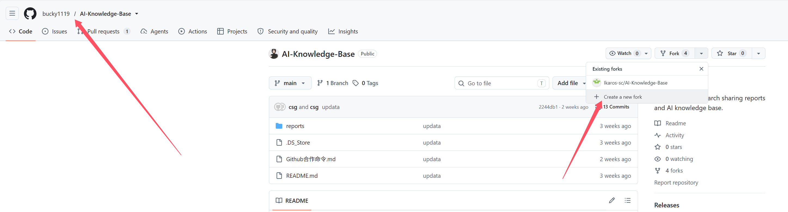
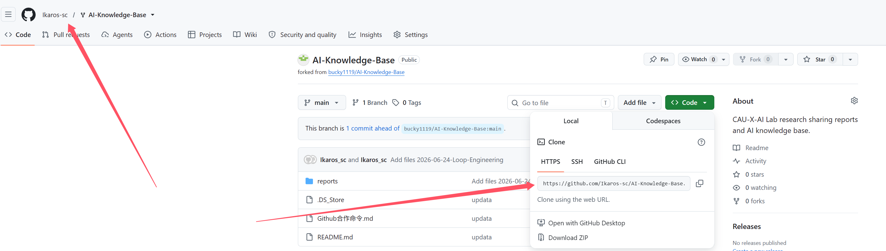

# GitHub Fork 并上传本地文件完整流程

本文记录如何在 GitHub 上 fork 仓库，并把本地文件提交、推送到自己的仓库中。也包含一次实际遇到的认证报错处理方法。

## 一、Fork 目标仓库

1. 打开你想 fork 的 GitHub 仓库页面（https://github.com/bucky1119/AI-Knowledge-Base）。
2. 点击页面右上角的 **Fork**。
3. 选择自己的 GitHub 账号。
4. 等待 GitHub 创建完成。

示例截图：



Fork 后，你会得到一个属于自己的仓库副本。

例如原仓库是：

```text
https://github.com/original-user/project
```

Fork 后可能变成：

```text
https://github.com/your-name/project
```

## 二、复制自己仓库的地址

进入 fork 后的仓库页面，点击绿色的 **Code** 按钮。

选择 **HTTPS**，复制仓库地址，例如：

```text
https://github.com/your-name/project.git
```



## 三、克隆仓库到本地

打开 PowerShell 或 Git Bash。

进入你想存放项目的目录，例如：

```powershell
cd D:\llm-workspace\AI-share\github
```

执行克隆命令：

```powershell
git clone https://github.com/your-name/project.git
```

进入项目目录：

```powershell
cd project
```

<span style="color: blue;">实际案例中使用的目录是：</span>

```text
PS C:\Users\1> cd D:\llm-workspace\AI-share\github\
PS D:\llm-workspace\AI-share\github> git clone https://github.com/Ikaros-sc/AI-Knowledge-Base.git
Cloning into 'AI-Knowledge-Base'...
remote: Enumerating objects: 150, done.
remote: Counting objects: 100% (92/92), done.
remote: Compressing objects: 100% (86/86), done.
remote: Total 150 (delta 11), reused 84 (delta 5), pack-reused 58 (from 1)
Receiving objects: 100% (150/150), 51.47 MiB | 11.12 MiB/s, done.
Resolving deltas: 100% (24/24), done.
PS D:\llm-workspace\AI-share\github> cd .\AI-Knowledge-Base\
```

命令：

```powershell
cd D:\llm-workspace\AI-share\github
git clone https://github.com/Ikaros-sc/AI-Knowledge-Base.git
cd .\AI-Knowledge-Base\
```

## 四、把本地文件放入仓库目录

把需要上传的文件复制到刚刚 clone 下来的项目文件夹中（直接在文件夹中操作，不需要在终端）。

例如：

```text
project/
  reports/
    2026-06-24-Loop-Engineering/
      Loop Engineering.md
```

## 五、查看当前改动

在项目目录下执行：

```powershell
git status
```

如果 Git 识别到了新文件，会显示类似：

```text
Untracked files:
  reports/2026-06-24-Loop-Engineering/Loop Engineering.md
```

<span style="color: blue;">本次实际测试输出如下：</span>

```text
PS D:\llm-workspace\AI-share\github\AI-Knowledge-Base> git status
On branch main
Your branch is up to date with 'origin/main'.

Untracked files:
  (use "git add <file>..." to include in what will be committed)
        reports/2026-06-24-Loop-Engineering/

nothing added to commit but untracked files present (use "git add" to track)
```

## 六、添加文件到暂存区

添加所有改动：

```powershell
git add .
```

也可以只添加某个文件：

```powershell
git add "reports/2026-06-24-Loop-Engineering/Loop Engineering.md"
```

<span style="color: blue;">本次实际测试输出如下：</span>

```text
PS D:\llm-workspace\AI-share\github\AI-Knowledge-Base> git add .
warning: in the working copy of 'reports/2026-06-24-Loop-Engineering/Loop Engineering.md', LF will be replaced by CRLF the next time Git touches it
```

这个 warning 是 Windows 上常见的换行符提示，通常不影响提交。

## 七、提交改动

执行：

```powershell
git commit -m "Add files 2026-06-24-Loop-Engineering"
```

成功后会看到类似输出：

```text
[main 0c95e90] Add files 2026-06-24-Loop-Engineering
 1 file changed, 227 insertions(+)
 create mode 100644 reports/2026-06-24-Loop-Engineering/Loop Engineering.md
```

这说明 commit 已经成功。

<span style="color: blue;">本次实际测试输出如下：</span>

```text
PS D:\llm-workspace\AI-share\github\AI-Knowledge-Base> git commit -m "Add files 2026-06-24-Loop-Engineering"
[main 0c95e90] Add files 2026-06-24-Loop-Engineering
 1 file changed, 227 insertions(+)
 create mode 100644 reports/2026-06-24-Loop-Engineering/Loop Engineering.md
```

## 八、推送到 GitHub

如果当前分支是 `main`，执行：

```powershell
git push origin main
```

如果当前分支是 `master`，执行：

```powershell
git push origin master
```

可以用下面命令查看当前分支：

```powershell
git branch
```

带 `*` 的就是当前分支。

<span style="color: blue;">本次实际测试输出如下：</span>

```text
PS D:\llm-workspace\AI-share\github\AI-Knowledge-Base> git push origin main
info: please complete authentication in your browser...
Enumerating objects: 7, done.
Counting objects: 100% (7/7), done.
Delta compression using up to 16 threads
Compressing objects: 100% (4/4), done.
Writing objects: 100% (5/5), 4.83 KiB | 4.83 MiB/s, done.
Total 5 (delta 2), reused 0 (delta 0), pack-reused 0 (from 0)
remote: Resolving deltas: 100% (2/2), completed with 2 local objects.
To https://github.com/Ikaros-sc/AI-Knowledge-Base.git
   2244db1..0c95e90  main -> main
```

<span style="color: blue;">这说明文件已经成功推送到 GitHub 远程仓库。</span>

## 九、推送认证问题处理

GitHub 已经不支持用账号密码直接进行 Git 操作。现在通常有两种方式：

1. 使用浏览器认证。
2. 使用 Personal Access Token。

如果已经执行过 `git commit` 并成功，就不需要重新 commit。只需要解决认证问题后重新执行 push。

<span style="color: blue;">实际案例中，第一次可能会看到类似报错：</span>

```text
remote: Invalid username or token. Password authentication is not supported for Git operations.
fatal: Authentication failed for 'https://github.com/Ikaros-sc/AI-Knowledge-Base.git/'
```

后续再次执行 push 时，Git 提示：

```text
info: please complete authentication in your browser...
```

这时按浏览器提示完成 GitHub 登录授权即可。

### 方法一：使用 Personal Access Token

打开 GitHub Token 设置页面：

```text
https://github.com/settings/tokens
```

操作步骤：

1. 点击 **Generate new token**。
2. 可以选择 **Generate new token (classic)**。
3. 勾选 `repo` 权限。
4. 生成 token。
5. 复制 token。注意 token 只会显示一次。

示例截图：


然后回到 PowerShell，重新执行：

```powershell
git push origin main
```

如果弹出登录窗口：

```text
Username: 填 GitHub 用户名
Password: 填刚刚生成的 token，不是 GitHub 密码
```

例如用户名可能是：

```text
Ikaros-sc
```

### 如果仍然认证失败，清除旧凭据

Windows 可能缓存了错误的 GitHub 密码或 token。

可以执行：

```powershell
cmdkey /delete:git:https://github.com
```

然后重新推送：

```powershell
git push origin main
```

再次弹出登录时：

```text
Username: GitHub 用户名
Password: GitHub Personal Access Token
```

### 方法二：使用 GitHub CLI 登录

如果安装了 GitHub CLI，可以用这种方式登录：

```powershell
gh auth login
```

按提示选择：

```text
GitHub.com
HTTPS
Login with a web browser
```

浏览器授权完成后，再执行：

```powershell
git push origin main
```

## 十、上传完成后检查与 Pull Request

推送成功后，打开 GitHub 仓库页面并刷新。

例如：

```text
https://github.com/Ikaros-sc/AI-Knowledge-Base
```

如果看到刚刚提交的文件，说明上传成功。

如果你是 fork 别人的仓库，并且希望把改动提交给原仓库，需要创建 Pull Request。

步骤：

1. 打开自己 fork 后的仓库页面。
2. 点击 **Contribute** 或 **Compare & pull request**。
3. 检查 base 仓库和 compare 仓库是否正确。
4. 检查改动文件是否正确。
5. 填写 Pull Request 标题和说明。
6. 点击 **Create pull request**。

比较改动示例：


创建 Pull Request 示例：


