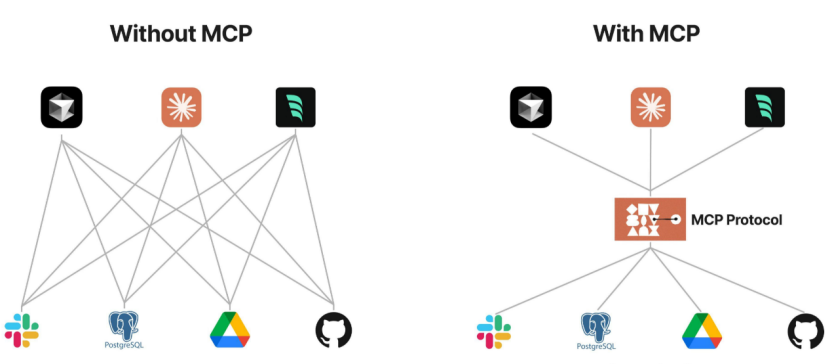

# Model Context Protocol（MCP）：让 Agent 连接外部工具的统一协议

---

## 1. 背景：为什么 Agent 需要 MCP

大语言模型本身擅长生成文本、总结信息和推理，但默认无法直接知道外部环境中的实时信息。例如，它不知道：

- 本地项目文件中最新修改了什么；
- GitHub 仓库当前有哪些 issue 或 pull request；
- 公司内部数据库中某条业务数据的真实状态；
- 日志系统里最近出现了哪些错误；
- 日历、文档、接口平台中存放的外部上下文。

如果 AI 只是聊天，这个问题不明显；但当 AI 逐渐变成 Agent，需要真正完成任务时，就必须具备读取外部上下文、调用工具和连接业务系统的能力。

例如，用户提出任务：

> “请检查某个 GitHub 仓库最近有哪些 issue 最值得优先处理。”

一个真正有用的 Agent 不能只给出通用建议，而需要访问 GitHub，读取 issue 列表、标签、更新时间、评论数量，然后再进行归纳和排序。因此，Agent 工程的一个关键问题是：

> 如何让 AI 应用安全、稳定、可复用地连接外部工具和数据源？

MCP 正是围绕这个问题提出的协议。

---

## 2. MCP 是什么

MCP 全称 **Model Context Protocol**，即“模型上下文协议”。Anthropic 在 2024 年 11 月发布 MCP，将其定位为连接 AI assistant 与真实数据系统的开放标准。MCP 官方文档也将其描述为连接 AI 应用与外部系统的开源标准，外部系统包括本地文件、数据库、搜索工具、计算器和业务工作流等。

MCP 的核心作用不是让模型本身变聪明，而是统一 AI 应用连接外部系统的方式。官方文档中常用一个类比：

> **MCP 类似 AI 应用的 USB-C 接口。**

USB-C 的价值在于统一连接标准，使电脑能够连接显示器、硬盘、手机和充电器。MCP 的价值类似：AI 应用通过统一协议连接文件系统、数据库、GitHub、浏览器、企业 API 等外部系统。

在没有 MCP 的情况下，不同 AI 应用往往需要为同一个外部系统重复开发连接逻辑；有了 MCP 后，一个 MCP Server 暴露的工具或资源能够被多个支持 MCP 的 AI 应用复用。


---

## 3. MCP 的核心架构

MCP 采用 Client-Server 架构，主要包含三个角色：

| 角色 | 作用 | 通俗理解 |
|---|---|---|
| MCP Host | 发起交互的 AI 应用 | Claude Desktop、ChatGPT、Cursor、VS Code、Agent 应用 |
| MCP Client | Host 内部负责连接 MCP Server 的组件 | AI 应用中的连接器 |
| MCP Server | 暴露外部能力的程序 | GitHub Server、数据库 Server、文件系统 Server、业务 API Server |

整体结构如下：

```text
用户
 ↓
MCP Host：AI 应用
 ↓
MCP Client：负责与 Server 建立连接
 ↓
MCP Server：暴露工具、资源和提示模板
 ↓
外部系统：文件、数据库、GitHub、搜索引擎、业务 API
```

一个 Host 可以连接多个 MCP Server。例如，一个 IDE Agent 能够同时连接：

- 文件系统 MCP Server：读取本地代码和文档；
- GitHub MCP Server：查询 issue、pull request 和 commit；
- 数据库 MCP Server：查询表结构或业务数据；
- 日志系统 MCP Server：查看线上错误记录。


---

## 4. MCP Server 暴露的三类能力

MCP Server 主要向 AI 应用暴露三类能力：**Tools、Resources、Prompts**。

| 能力 | 主要用途 | 控制方式 | 示例 |
|---|---|---|---|
| Tools | 执行动作或调用外部系统 | 通常由模型选择调用 | 查询数据库、调用 API、执行计算、创建 issue |
| Resources | 提供上下文数据 | 通常由应用读取后提供给模型 | 文件内容、数据库 schema、日志、配置文档 |
| Prompts | 提供可复用提示模板 | 通常由用户显式选择 | 代码审查模板、论文总结模板、报错分析模板 |

### 4.1 Tools：让模型具备“行动能力”

Tools 类似函数调用，用于让模型与外部系统交互。例如：

```text
search_web(query)            # 搜索网页
query_database(sql)          # 查询数据库
list_github_issues(repo)     # 读取 GitHub issue
run_tests()                  # 运行测试
```

官方规范中，Tool 由 MCP Server 暴露给模型调用，每个 Tool 有唯一名称、功能描述和参数 schema。模型根据用户任务判断是否需要调用某个 Tool，再由 MCP Client 将调用请求转发给 MCP Server。

示例：

```json
{
  "name": "list_github_issues",
  "description": "List open issues in a GitHub repository",
  "inputSchema": {
    "type": "object",
    "properties": {
      "repo": {
        "type": "string",
        "description": "Repository name, e.g. owner/repo"
      }
    },
    "required": ["repo"]
  }
}
```

如果用户询问“某个仓库最近有哪些 open issue”，模型能够选择调用 `list_github_issues`，而不是凭空生成答案。

### 4.2 Resources：让模型获取“真实上下文”

Resources 是 MCP Server 暴露的上下文资料。例如：

- 项目中的 `README.md`；
- 数据库 schema；
- 配置文件；
- 运行日志；
- 业务规则文档。

例如在 IDE 中，用户询问“这个项目如何启动”，AI 应用能够通过文件系统 MCP Server 获取 `package.json`、`README.md`、`.env.example` 等文件内容，再基于真实项目上下文回答。

### 4.3 Prompts：让常用任务形成标准入口

Prompts 是 MCP Server 提供的提示模板，用于标准化常见任务。例如：

```text
/code_review        # 代码审查
/explain_error      # 报错解释
/summarize_paper    # 论文总结
/write_test_case    # 测试用例生成
```

Prompts 更像“可复用任务模板”。它不直接访问外部系统，而是帮助用户以标准方式触发某类任务。

---

## 5. 一个完整例子：用 MCP 处理 GitHub issue

任务：

> “查看 AI-Knowledge-Base 仓库最近的 open issue，并总结处理优先级。”

基于 MCP 的流程如下：

```text
1. 用户向 AI 应用提出任务；
2. MCP Host 判断任务需要 GitHub 上下文；
3. MCP Client 向 GitHub MCP Server 获取可用工具列表；
4. 模型选择 list_issues 工具；
5. MCP Server 调用真实 GitHub API；
6. GitHub 返回 issue 标题、标签、更新时间、评论数等信息；
7. 模型基于真实返回结果生成优先级总结。
```

这个例子体现了 MCP 的关键价值：模型不是直接“知道”GitHub 内容，也不是随意执行外部操作，而是通过标准协议发现工具、调用工具、接收结果，再进行推理和表达。


---

## 6. MCP 与 Function Calling、LangChain、Skills 的区别

MCP 容易与 Function Calling、LangChain、Skills 混淆。它们关注的问题不同。

| 对象 | 主要解决的问题 | 与 MCP 的区别 |
|---|---|---|
| Function Calling | 模型如何按 schema 表达函数调用 | 偏模型输出格式 |
| LangChain | 如何搭建 LLM 应用、Agent、RAG 工作流 | 偏应用开发框架 |
| Skills | 如何沉淀某类任务的经验、流程和约束 | 偏任务知识与操作流程 |
| MCP | 外部工具、数据源、提示模板如何被 AI 应用标准化发现和调用 | 偏连接协议与生态复用 |

从工程化视角理解：

```text
Prompt Engineering：让模型更好地理解任务
Skills：沉淀任务经验和操作流程
LangChain / Agent Framework：组织 LLM 应用和工作流
Function Calling：规范模型如何提出函数调用
MCP：规范外部工具和数据源如何接入 AI 应用
```

因此，MCP 并不是替代 LangChain、Function Calling 或 Skills，而是补齐 Agent 工程中的“工具接入层”。

例如，论文阅读场景中：

- Skill 定义“如何阅读论文、提取方法和实验”；
- 文件系统 MCP Server 负责读取 PDF、Markdown 或笔记文件；
- GitHub MCP Server 负责读取课题组知识库；
- Function Calling 负责让模型以结构化方式发起工具调用；
- Agent 框架负责组织整个流程。

---

## 7. MCP 的价值与边界

### 7.1 主要价值

MCP 的价值主要体现在三个方面。

第一，降低重复集成成本。一个 GitHub MCP Server、数据库 MCP Server 或文件系统 MCP Server 实现后，能够被多个 AI 应用复用。

第二，增强上下文能力。AI 应用不再只依赖用户输入的静态 prompt，而能通过 Tools 和 Resources 获取实时项目文件、数据库结构、日志、仓库状态等外部信息。

第三，有利于工程治理。标准协议更便于做权限控制、用户确认、日志记录、调用审计和 Server 复用。

### 7.2 安全边界

MCP 连接的是外部系统，因此不能只关注“能不能调用”，还必须关注“是否应该调用”和“调用范围是否安全”。常见风险包括：

| 风险 | 示例 | 建议 |
|---|---|---|
| 权限过大 | 文件系统 Server 允许读取整个电脑 | 限定目录范围，优先只读 |
| 写操作误触发 | 模型误调用删除、发布、提交接口 | 高风险操作必须人工确认 |
| Prompt Injection | 外部文档诱导模型调用危险工具 | 外部内容不能完全信任 |
| 数据泄露 | 私有文件被发送到不可信服务 | 明确数据授权范围 |
| 工具投毒 | 恶意 MCP Server 伪装成正常工具 | 只使用可信来源 Server |

MCP 是连接协议，不是完整的安全系统。实际落地时仍需配合权限隔离、用户确认、日志审计和最小权限原则。


---

## 8. 参考资料

### 8.1 官方资料

1. **MCP 官方介绍：What is the Model Context Protocol?**  
   适合截图：MCP 定义、USB-C 类比、生态说明。  
   https://modelcontextprotocol.io/docs/getting-started/intro

2. **MCP 官方架构文档：Architecture overview**  
   适合截图：Host / Client / Server 架构。  
   https://modelcontextprotocol.io/docs/learn/architecture

3. **MCP 官方规范：Specification 2025-06-18**  
   适合截图：Tools、Resources、Prompts 等 Server features。  
   https://modelcontextprotocol.io/specification/2025-06-18

4. **Anthropic 发布说明：Introducing the Model Context Protocol**  
   适合截图：MCP 发布背景和解决 fragmented integrations 的动机。  
   https://www.anthropic.com/news/model-context-protocol

5. **MCP GitHub 组织主页**  
   适合截图：SDK、servers、inspector 等官方开源生态。  
   https://github.com/modelcontextprotocol

### 8.2 视频资料

> 正式概念建议以官方文档为准，视频更适合辅助理解和寻找演示素材。

1. **Anthropic Academy: Introduction to Model Context Protocol**  
   https://anthropic.skilljar.com/introduction-to-model-context-protocol

2. **DeepLearning.AI: MCP — Build Rich-Context AI Apps with Anthropic**  
   https://learn.deeplearning.ai/courses/mcp-build-rich-context-ai-apps-with-anthropic/lesson/fkbhh/introduction

3. **YouTube: Building Agents with Model Context Protocol - Full Workshop**  
   https://www.youtube.com/watch?v=kQmXtrmQ5Zg

4. **YouTube: All You Need To Know About Model Context Protocol (MCP)**  
   https://www.youtube.com/watch?v=-UQ6OZywZ2I

5. **YouTube: MCP Tutorial: Build Your First MCP Server**  
   https://www.youtube.com/watch?v=jLM6n4mdRuA

6. **B站：模型上下文协议（MCP-Model Context Protocol）**  
   https://www.bilibili.com/video/BV1siQmYLEQJ/

### 8.3 论坛和社区资料

1. **Reddit: r/mcp**  
   https://www.reddit.com/r/mcp/

2. **Reddit 讨论：Model Context Protocol vs Tool Calling**  
   https://www.reddit.com/r/mcp/comments/1lxg4qx/i_am_still_confused_on_the_difference_between/

3. **Phil Schmid: Model Context Protocol — An overview**  
   https://www.philschmid.de/mcp-introduction

4. **LangChain 文档：Model Context Protocol integration**  
   https://docs.langchain.com/oss/python/langchain/mcp