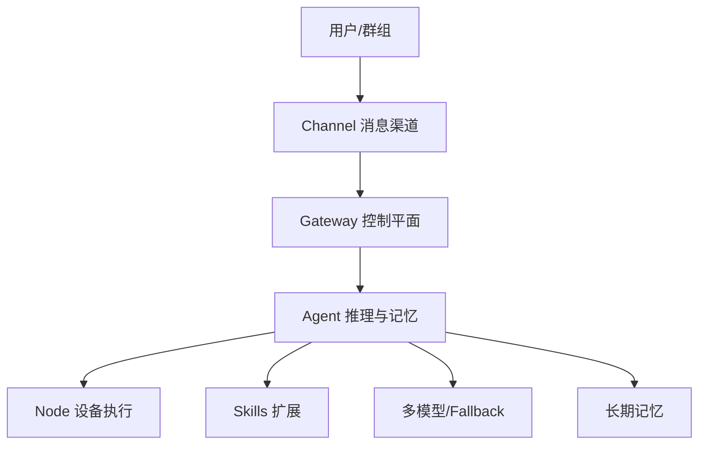

# OpenClaw 综述

## 一句话结论

[[entities/项目_OpenClaw]] 的核心价值不是“更会聊天”，而是把 [[concepts/概念_AI_Agent]] 变成长期在线、可通过消息平台唤醒、能记忆、能执行工具、能自我扩展的个人系统；它的核心代价是安全和成本必须由使用者主动治理。

## 总体框架

## 支撑页面

- 架构：[[concepts/架构_OpenClaw_Gateway_Node_Channel]]
- 记忆：[[concepts/技术_OpenClaw_记忆系统]]
- 工作区：[[concepts/技术_OpenClaw_Agent工作区]]
- Session：[[concepts/技术_OpenClaw_Session与用户识别]]
- 渠道：[[concepts/集成_OpenClaw_渠道接入]]
- 部署：[[concepts/部署_OpenClaw]]
- Skills：[[concepts/技术_OpenClaw_Skills系统]]
- 设计：[[concepts/设计_OpenClaw_设计哲学]]
- 安全：[[concepts/安全_OpenClaw_安全模型]]
- 成本：[[concepts/成本_OpenClaw_成本控制]]
- 国内生态：[[concepts/生态_OpenClaw_国内生态]]
- 文化：[[concepts/文化_养虾文化]]

## 当前理解

OpenClaw 是 Agent 产品化的一种典型路线：用消息平台降低入口摩擦，用文件化工作区沉淀人格和记忆，用 Skills 把工具生态交给社区，用多模型降低成本和厂商锁定。

这个路线的反面是攻击面扩大：长期在线、工具执行、本地文件、第三方 Skill、消息渠道和模型账单全部叠加在一起，因此“会部署”和“能安全长期运行”是两个不同层级的问题。

## 关键比较

- [[comparisons/OpenClaw_vs_Claude_Code]]
- [[comparisons/OpenClaw_部署方案对比]]
- [[comparisons/OpenClaw_模型提供商对比]]
- [[comparisons/OpenClaw_国内产品选购]]

## 未决问题

- v1.4.0 中列出的版本、价格、产品和安全事件是否已有后续变化，需要未来 ingest 新资料时校正。
- ClawHub 恶意比例和精选列表质量需要持续验证。
- 国产封装产品的实际数据控制、版本同步和安全补丁机制需要单独来源支撑。
