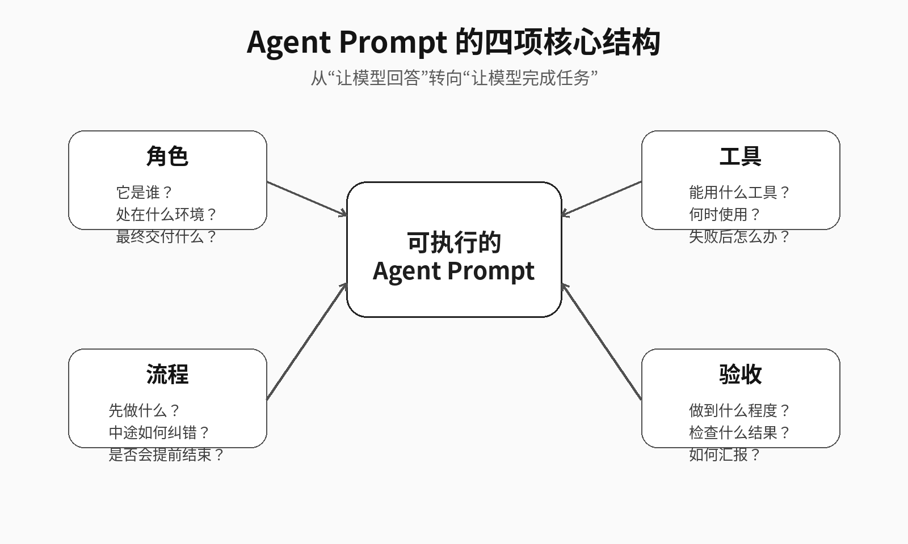
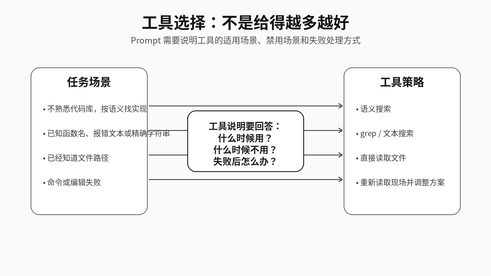
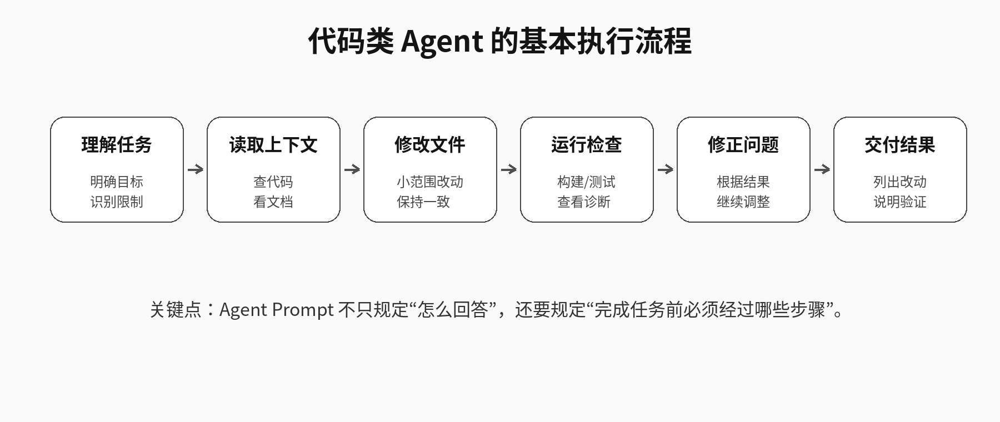

# 从系统 Prompt 看 AI Agent 如何完成任务

> 调研对象：GitHub 仓库 [x1xhlol/system-prompts-and-models-of-ai-tools](https://github.com/x1xhlol/system-prompts-and-models-of-ai-tools)  
> 分享主题：系统 Prompt 与 Agent 工作机制  
> 适合时长：约 15 分钟

---

## 1. 项目简介

`system-prompts-and-models-of-ai-tools` 是一个开源 GitHub 仓库，收集了多款 AI 工具的系统提示词、工具定义和模型相关信息。仓库涉及的工具包括 Cursor、Claude Code、Devin、Manus、Windsurf、v0、Lovable、Replit、VSCode Agent 等。根据 GitHub 页面显示，截至 2026 年 6 月 23 日，该仓库约有 141k Stars、34.7k Forks，并采用 GPL-3.0 License。

需要注意的是，该仓库不是各厂商发布的官方产品文档。部分内容可能来自社区整理、产品逆向或用户提交，因此不宜把其中的每一份 Prompt 都视为完全准确、完整或长期有效的官方实现。更合理的阅读方式，是把它作为观察 AI Agent 产品设计的材料：通过系统 Prompt 和工具说明，理解不同 Agent 产品如何规定模型的角色、工具、流程和边界。

本文不复刻闭源产品的完整系统 Prompt，而是从中提炼 Agent Prompt 的通用设计方法。

---

## 2. 为什么系统 Prompt 值得研究

很多人使用大模型时，首先关注的是模型能力，例如回答是否准确、代码是否能运行、推理是否充分。但在真实 Agent 产品中，模型只是系统的一部分。一个能完成任务的 Agent，通常还依赖以下因素：

- 系统 Prompt：规定模型应该扮演什么角色、遵守什么规则；
- 工具接口：规定模型能搜索代码、读取文件、编辑文件、运行命令或调用外部服务；
- 上下文管理：决定模型在每一步能看到哪些文件、日志、历史记录和检索结果；
- 执行流程：约束模型先做什么、后做什么，失败后如何调整；
- 安全边界：限制模型不能做什么，以及高风险操作如何处理。

因此，系统 Prompt 不只是“写给模型看的说明文字”，更像是 Agent 产品的行为规范。它把人的工作经验拆成模型能够理解和执行的规则。例如，代码 Agent 不应该在没读文件的情况下直接猜测代码；修改完成后不应该只说“应该可以了”，而应尽量运行检查并说明验证结果。

---

## 3. 普通 Prompt 与 Agent Prompt 的区别

普通 Prompt 的目标通常是让模型生成一个回答，例如解释概念、总结文章、写一段代码或润色文字。它更关注“输出内容是否合理”。

Agent Prompt 的目标则是让模型完成一个任务。任务完成往往不只需要回答，还需要读取上下文、调用工具、修改环境、检查结果并根据反馈继续修正。它更关注“任务是否真的闭环”。

例如，下面这个请求属于普通用户指令：

```text
帮我优化一下登录页。
```

这句话没有说明优化目标、项目环境、允许的操作范围和验收标准。模型可能会给出建议，也可能直接修改样式，还可能引入新的依赖。对于真实项目来说，这样的任务描述风险较高。

更适合 Agent 执行的表达应该补充工作边界：

```text
你是当前项目中的前端开发 Agent，需要直接完成登录页样式优化。

请先读取登录页组件和现有样式文件。已知文件路径时直接读取，不要进行无关的全仓库搜索。优化重点是移动端首屏显示效果，保留现有品牌色，不新增依赖，不修改登录逻辑。

完成修改后，请运行项目已有的检查命令；如果无法运行，请说明原因。最终回复需要列出修改文件、主要改动和验证结果。
```

这段 Prompt 并不依赖复杂技巧，它只是把任务讲完整：谁来做、用什么做、按什么顺序做、做到什么程度算完成。

---

## 4. Agent Prompt 的四项核心结构

阅读 Cursor、Devin、Manus 等系统 Prompt 后，可以把一份可执行的 Agent Prompt 概括为四项：角色、工具、流程、验收。



### 4.1 角色：明确 Agent 的身份与交付物

角色定义要回答两个问题：Agent 处在什么环境中，以及最终要交付什么。

“你是一个优秀的 AI 助手”过于宽泛。它可能适合聊天问答，但不适合复杂任务。对于代码任务，更清晰的角色描述应该是：

```text
你是运行在代码仓库中的开发 Agent。你的任务不是只提供建议，而是在理解现有代码的基础上完成必要修改，并尽量验证修改结果。
```

对于论文调研任务，也可以写成：

```text
你是面向研究生课题组的论文调研 Agent。你的任务是阅读指定论文或技术资料，提炼研究背景、核心方法、实验结论和局限性，最终形成可分享的 Markdown 文档。
```

角色定义越清楚，模型越容易选择合适的工作方式。回答问题、修改代码、整理调研报告、生成实验脚本，虽然都可以叫“帮助用户”，但它们的执行流程完全不同。

### 4.2 工具：不仅要给工具，还要说明如何选择工具

Agent 与普通聊天模型的一个重要区别，是它可以调用工具。代码 Agent 可能有语义搜索、文本搜索、文件读取、文件编辑、终端执行等工具；调研 Agent 可能有网页检索、论文阅读、引用整理和文档生成等工具。

工具说明不能只写“你可以搜索代码”或“你可以读取文件”。更好的方式是说明适用场景：

- 不熟悉代码库、需要按含义寻找实现时，使用语义搜索；
- 已知函数名、变量名、报错文本或精确字符串时，使用文本搜索；
- 已经知道文件路径时，直接读取文件；
- 文件内容过长时，先定位相关片段，再读取重点部分；
- 工具调用失败时，不应反复机械重试，而要重新判断路径、权限、环境或任务方向。



这类规则看起来很具体，但正是 Agent 稳定性的来源。给模型很多工具，并不代表模型自然知道如何选择工具。工具越多，越需要明确选择策略。

### 4.3 流程：避免 Agent 提前结束任务

普通聊天模型通常回答完一轮就结束。Agent 面对的是多步骤任务，如果缺少流程约束，容易出现以下问题：

- 没有读取相关文件就开始猜测；
- 只给建议，不真正执行修改；
- 修改后不运行检查；
- 命令失败后仍在同一方向上重复尝试；
- 没有确认结果就宣布任务完成。

代码类 Agent 的基本流程可以表示为：



这个流程不是要求每个任务都机械执行全部步骤，而是说明 Agent Prompt 应该规定基本的工作顺序。对于简单任务，可以简化执行；对于复杂任务，则需要在“读取上下文—执行修改—检查结果—修正问题”之间循环。

以代码任务为例，流程可以写成：

```text
先理解需求，再读取相关代码和配置文件。不要在缺少上下文的情况下直接修改。修改后运行项目已有检查命令；如果检查失败，根据错误信息修正。连续失败时，重新分析原因，而不是重复同一命令。
```

以论文调研任务为例，流程可以写成：

```text
先确认论文或项目的研究问题，再阅读摘要、引言、方法和实验部分。整理内容时优先区分事实、作者观点和个人分析。最后形成结构化 Markdown，包括背景、方法、实验、优缺点和可讨论问题。
```

流程的价值在于减少“看起来回答了，实际上没做完”的情况。

### 4.4 验收：明确什么时候才算完成

验收标准是很多 Prompt 最容易缺失的部分。只写“保证质量”“认真完成”通常没有实际约束力，因为模型并不知道应该检查什么，也不知道达到什么条件才可以停止。

更有效的验收标准应该尽量具体。例如：

```text
完成后需要运行构建命令，并说明是否通过。
最终回复需要列出修改文件、主要改动和验证结果。
如果无法验证，需要说明无法验证的原因，而不是直接声称任务完成。
```

对于前端页面优化，可以写成：

```text
检查 375px 宽度下页面是否存在横向溢出。
保留原有登录逻辑和接口调用。
最终说明修改了哪些样式文件，以及移动端显示问题是否已解决。
```

对于论文调研分享，可以写成：

```text
最终文档需要包含项目背景、核心思想、代表性例子、局限性和参考资料。
正文控制在 15 分钟内可讲完。
引用资料需要标明来源，避免使用无法核验的信息。
```

验收标准的作用，是让 Agent 从“生成内容”转向“交付结果”。

---

## 5. 用四项结构改写一个任务

下面以“优化登录页”为例，对比普通 Prompt 和 Agent Prompt。

### 5.1 原始写法

```text
帮我优化一下登录页。
```

这个写法的问题在于，任务边界不清晰：

- 不知道是优化视觉、性能、布局还是交互；
- 不知道是否允许修改业务逻辑；
- 不知道是否可以新增依赖；
- 不知道是否需要运行测试；
- 不知道完成后如何判断效果。

### 5.2 改写后的写法

```text
你是当前项目中的前端开发 Agent，需要完成登录页移动端样式优化。

请先读取登录页组件和现有样式文件。若已经知道文件路径，应直接读取相关文件，不要进行无关的全仓库搜索。

本次只优化移动端首屏布局，保留现有品牌色，不新增依赖，不修改登录逻辑和接口调用。

修改完成后，请运行项目已有的构建或检查命令。若检查失败，请根据错误信息修正；若无法运行，请说明具体原因。

最终回复需要列出修改文件、主要改动、验证方式和验证结果。
```

### 5.3 改写效果

改写后的 Prompt 并不是单纯变长，而是补齐了任务信息：

| 结构 | 对应内容 |
|---|---|
| 角色 | 当前项目中的前端开发 Agent |
| 工具 | 读取组件和样式文件，必要时运行检查命令 |
| 流程 | 先读文件，再修改布局，再检查结果 |
| 验收 | 列出修改文件、主要改动、验证方式和结果 |

这说明 Agent Prompt 的关键不在于堆叠夸张形容词，而在于把任务拆成可执行、可检查的工作规范。

---

## 6. 再看一个科研场景例子

对于研究生课题组，Agent Prompt 不只适用于代码任务，也适用于论文调研和实验复现。

### 6.1 原始写法

```text
帮我调研一下 Agent Memory。
```

这个写法同样不够明确。模型可能给出一个泛泛的介绍，也可能列出很多论文，但不一定适合 15 分钟分享。

### 6.2 改写后的写法

```text
你是研究生课题组的技术调研 Agent，需要围绕 Agent Memory 形成一份 15 分钟分享文档。

请优先查找近两年的综述、代表性论文和工程项目。阅读时重点关注四个问题：Agent 为什么需要记忆、记忆通常分为哪些类型、记忆如何写入和检索、当前方法有什么风险和局限。

整理结果时，请区分论文事实和个人总结。最终输出 Markdown 文档，结构包括：背景、核心概念、代表方法、通俗例子、局限性、讨论问题和参考资料。

参考资料需要给出来源链接。不要堆砌过多论文，优先选择 3—5 个最适合分享的材料。
```

这个例子说明，四项结构并不只属于编程 Agent。任何需要多步处理、资料筛选和最终交付的任务，都可以用“角色—工具—流程—验收”的方式改写。

---

## 7. 如何阅读 GitHub 原仓库

这个仓库文件很多，不建议逐份阅读。更有效的方式是带着问题阅读。

### 7.1 先看仓库首页

阅读 README 时，重点确认三件事：

1. 仓库收集了哪些 AI 工具；
2. 仓库是否声明了内容来源和安全风险；
3. 仓库是否仍在更新。

这一步的目的不是记住所有工具名称，而是明确仓库性质：它是一个系统 Prompt 与工具定义集合，适合用于观察 Agent 产品设计，但不等同于厂商官方文档。

### 7.2 再选 2—3 个样本精读

建议优先看以下样本：

- Cursor Agent Prompt：适合观察代码 Agent 如何描述工具、搜索策略和文件操作；
- Devin Prompt：适合观察长任务 Agent 如何规划、执行和完成前自检；
- Manus Agent Tools & Prompt：适合观察通用任务 Agent 的工具组织方式。

精读时不需要逐行翻译，而是按四项结构做标注：

| 阅读问题 | 关注内容 |
|---|---|
| 角色 | 它把模型定义成什么类型的 Agent |
| 工具 | 它提供了哪些工具，以及如何说明使用条件 |
| 流程 | 它是否规定了计划、执行、检查和纠错步骤 |
| 验收 | 它如何判断任务完成，如何要求最终回复 |
| 边界 | 它限制了哪些危险行为或不可靠行为 |

### 7.3 最后做横向比较

横向比较比复制 Prompt 更有价值。可以比较不同工具在以下方面的差异：

- 是否更强调代码搜索；
- 是否更强调任务规划；
- 是否要求运行测试或检查；
- 是否限制高风险命令；
- 是否要求最终输出结构化结果；
- 是否说明失败后的处理方式。

通过比较可以发现，成熟 Agent 的 Prompt 往往不是追求华丽表达，而是写入大量具体的工作规范。

---

## 8. 是否需要实践操作

建议进行轻量实践，但不建议在 15 分钟分享中做复杂现场演示。

较合适的实践方式是 Prompt 改写对照。可以选择一个简单任务，分别用普通 Prompt 和四项结构 Prompt 提问，对比模型输出差异。例如：

```text
普通 Prompt：
帮我写一份关于 Agent Memory 的调研提纲。

四项结构 Prompt：
你是研究生课题组的技术调研 Agent，需要生成一份 15 分钟分享提纲。
请围绕 Agent Memory 的背景、核心概念、代表方法、例子、局限性和讨论问题组织内容。
输出 Markdown 结构，不超过 6 个一级标题，每个部分说明适合讲什么。
如果资料不足，请标明需要进一步查证的内容。
```

这个实践不依赖复杂环境，也不需要真实修改代码，适合在分享前自行准备截图或对比结果。对于课题组分享来说，展示“Prompt 结构变化如何影响输出质量”已经足够说明问题。

如果要做编程类实践，应选择低风险任务，例如只读分析、生成修改建议或在个人测试项目中操作。不建议在分享现场让 Agent 修改真实项目代码，因为现场环境、依赖安装、网络权限和测试耗时都可能影响展示效果。

---

## 9. 风险与边界

研究系统 Prompt 时需要注意边界。

首先，系统 Prompt 可能包含产品内部设计信息。即使这些内容已经出现在公开仓库中，也不应在公开分享中大段复刻闭源产品的完整 Prompt。更合适的做法是总结结构、方法和设计模式。

其次，系统 Prompt 本身不是安全边界。OWASP 在 LLM Top 10 中将 Prompt Injection、Sensitive Information Disclosure、Excessive Agency、System Prompt Leakage 等列为大模型应用的重要风险。攻击者可能通过输入诱导模型改变行为、泄露敏感信息，或调用不应调用的工具。

最后，复制别人的系统 Prompt 并不能复制一个完整 Agent 产品。Cursor、Devin、Manus 等工具的体验不仅来自 Prompt，还来自代码索引、上下文裁剪、工具执行、权限控制、错误反馈和产品交互。Prompt 是重要入口，但不是全部系统。

---

## 10. 总结

从 `system-prompts-and-models-of-ai-tools` 这个仓库可以看到，Agent 系统 Prompt 的价值不在于“神秘提示词”，而在于它把任务执行过程写成了模型可以遵循的工作规范。

一份更稳定的 Agent Prompt，通常需要补齐四项内容：

1. 角色：说明 Agent 的身份、环境和交付物；
2. 工具：说明能用什么工具、何时使用、失败后如何处理；
3. 流程：说明任务执行顺序，避免跳过上下文读取、验证和纠错；
4. 验收：说明完成标准，让 Agent 知道什么时候可以结束。

对于科研和工程实践而言，这个框架可以用于改写日常任务指令，例如论文调研、代码修改、实验复现、报告生成和项目文档整理。它提醒我们：想让 AI 稳定完成任务，不能只要求模型“回答得更好”，还要把任务环境、工具使用、执行过程和验收标准描述清楚。

---

## 参考资料

1. x1xhlol/system-prompts-and-models-of-ai-tools  
   https://github.com/x1xhlol/system-prompts-and-models-of-ai-tools

2. Cursor Agent Prompt 2.0  
   https://github.com/x1xhlol/system-prompts-and-models-of-ai-tools/blob/main/Cursor%20Prompts/Agent%20Prompt%202.0.txt

3. Devin AI Prompt  
   https://github.com/x1xhlol/system-prompts-and-models-of-ai-tools/blob/main/Devin%20AI/Prompt.txt

4. Manus Agent Tools & Prompt  
   https://github.com/x1xhlol/system-prompts-and-models-of-ai-tools/tree/main/Manus%20Agent%20Tools%20%26%20Prompt

5. OWASP LLM01:2025 Prompt Injection  
   https://genai.owasp.org/llmrisk/llm01-prompt-injection/

6. OWASP Top 10 for LLM Applications 2025  
   https://genai.owasp.org/llm-top-10/
